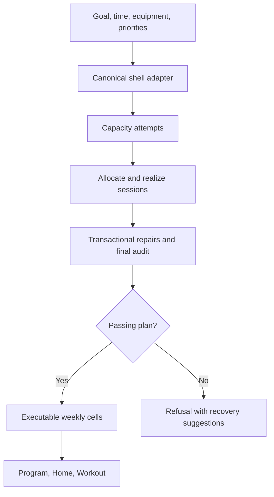

# Production engine map

Current production runtime: M234, app 4.0.0 build 823, Pursuit Engine 0.65.6. M235 verifies this exact behavior line; M236 hardens verification/release assurance and M237 hardens the CI dependency supply chain without changing engine behavior or runtime identity. The maintained source is the JavaScript in this repository. `RELEASE_MANIFEST.json` certifies the actual runtime and UI files. Historical TypeScript claims and development scripts are not the source of this release. The unreferenced historical root `app.js` bundle has been removed; the production entry is `modules/main.js`.

## Canonical computation and independent audits

Current behavior line: M234, Engine 0.65.6, with M228–M235 fully verified, M236 providing post-merge assurance hardening, and M237 pinning the verification toolchain. `modules/engine-api.js` is the shared production API. The UI imports training calculations and domain transactions from it; it no longer contains their implementations. `modules/training-domain/` contains catalog, record migrations, program transactions, prescription/loading coordination and historical analytics. These are maintained source modules, not generated files. React, DOM, storage I/O, notifications, audio and rendering remain UI-side concerns.

`engine-lab/export-engine.mjs` copies the canonical runtime byte for byte into an independent Node package with no exporter runtime dependencies. It extracts zero App.js declarations. Coverage schema 2 and snapshot hashes certify copied source identity. The complete App.js is retained only as integration evidence. `engine-lab/verify-parity.mjs` compares the standalone package with the running application's shared functions. `verification/m228-canonical-boundary-test.mjs` independently compares sessions, weekly prescriptions, volume and scheduling against 13 Build 816 golden scenarios.

## Generation and authority

`modules/main.js` mounts `App.js`. Creation and rebuild actions call `generateNextProgramForShell`; cycle creation calls `generateNextCycleForShell`. Both use the same capacity policy and audited generator. The browser import map resolves React and icons only: it no longer substitutes an alternative engine adapter. Node verification therefore exercises the production adapter.



The selected time band is capacity, not a quota. `capacity-generation.js` tries the requested seed first, then a bounded deterministic seed family. If necessary it reduces optional exercise density or the lower time-band edge; the selected maximum remains intact. Every accepted candidate passes the normal engine audit. The actual seed, request, and capacity adjustment are stored for reproducibility.

Within `generate.js`, muscle prescriptions and strength claims feed a provisional allocation and split topology. Actual strength anchors are realized before residual muscle allocation is recalculated, avoiding a circular estimate of how much time and muscle work the anchors consume. The realizer selects eligible exercises and prescriptions, sequences sessions, and protects structural intent. Later changes are evaluated as whole-program transactions; functional coverage, focus, recovery, arm coverage, and recoverable-dose repair cannot simply bypass the arbiter.

| Responsibility | Production source |
|---|---|
| Shell configuration, stable identities, equipment mapping, cell ownership | `app-shell-adapter.js`, `shell-equipment.js` |
| Time bands and deterministic attempts | `capacity-policy.js`, `capacity-generation.js` |
| Experience, phase, goal, priority, and capacity dose model | `prescription.js`, `config.js`, `phase-policy.js` |
| Strength-aware allocation and split/day contracts | `allocator.js`, `topology.js`, `focus-intent.js` |
| Exercise catalog and selection | `exercise-db.js`, `extended-exercise-catalog.js`, `exercise-selection-intelligence.js` |
| Realization, clock estimates, order, pairing, useful work | `realizer.js`, `exercise-economy.js`, `setup-economy.js`, `techniques.js` |
| Set events and muscle accounting | `events.js`, `ledgers.js`, `public-mev.js` |
| Final acceptance and conservative repair | `generate.js`, `arbiter.js`, `dose-reconciliation.js`, coverage/recovery modules |
| Shared lookup indexes and memoized candidate evaluation | `engine-context.js` |
| Rationale and prescription-method selection | `explainability.js`, `progression-style.js`, `method-policy.js` |

Paths in this table are relative to `modules/next-engine/`. `coach-regression.js` remains production code because the arbiter calls its objective guardrails. The higher-level verification oracle lives in `verification/coach-quality-oracle.mjs` and is not precached.

## One writer per prescription field

`nextEngine.program` is the audited base-program snapshot. `nextWeekPrescriptions[day:slot][week]` is its executable projection, including phase modulation and a requested recovery week. All generated-plan surfaces resolve through `getNextShellCell`.

| Data | Owner and purpose |
|---|---|
| Automatic sets, reps, RIR, rest, role, technique, progression style | Generated week cell, with immutable engine fallback |
| `overrides` identity metadata | Maps the visible slot to engine/shell exercise IDs |
| Explicit prescription edits | Per-field `prescriptionOwners: user`; manual plans seed editable fields as user-owned |
| `progStyle` | Explicit lifter method selection; automatic methods remain in engine cells |
| Pending workout input | `valueOwner: prescription` follows the current target; `valueOwner: user` preserves typed input |
| Completed logged sets | Historical performed values, with per-exposure prescription/effort provenance on new logs; preserved across edits, restore and tuning |

Generated values must not be copied into overrides as a second writer. Volume repair refuses to change user-owned sets. `commitProgram` resolves the next object once and writes that same object to open and saved state. Stale historical `auto` booleans do not override current field ownership.

`workout-runtime.js` builds runtime targets and reconciles pending input. The shell still owns timers, editable rows, warm-up/plate presentation, and its supported custom/template interfaces. Those pieces are active product behavior, not a second automatic program generator.

After projection, `volume-repair.js` finalizes exact working-week accessory sets against regional floors/ceilings and the executable session clock. Generation, cycle entry/adaptation, history-driven next blocks, and saved-plan Auto-fix share this transaction. The base engine snapshot remains immutable for a week-only correction; strength slots, user-owned counts, and recovery weeks stay protected. Repairs do not create an override mirror. Minimalist guidance uses the existing approach-aware prescriptions and its three-set cap survives weekly modulation and phase retargeting. Unresolved constraints retain an honest partial/unable result. See [M206_WORKING_WEEK_VOLUME_REPORT.md](M206_WORKING_WEEK_VOLUME_REPORT.md).

## History, progression, and cycles

`workout-history-adapter.js` resolves logged exercises from the visible roster and canonical shell cells, including explicit user fields and per-lift methods. New logs retain the actual prescription and whether effort was reported; later edits cannot change those historical targets. Older logs without that snapshot use the current canonical projection, with the existing conservative effort-provenance fallback. Unfinished rows, warmups and technique extensions are excluded from completed working-set evidence. `performance.js`, `loading.js`, `history.js`, `response.js`, and `recovery.js` supply progression decisions and comparable longitudinal evidence. A below-range performance can recommend a load decrease; an incomplete or noisy history is not automatically classified as a real stall.

`phase-transition.js` carries successful/protected exercises and per-exercise evidence into a new phase. Automatic progression selection knows block length and phase; explicit methods remain explicit. `simulation.js` supplies the weekly prescription projection used by production and shares tested progression context with the multi-block simulator.

`cycle-runtime-adapter.js` creates previews through the same passing-plan contract. Adaptive previews transition phases; static previews retarget dosage while retaining exercise identity. Static later blocks then reconcile the exact projected regional dose without replacing the roster. When a real block completes, advancement checks history readiness, can insert recovery from fatigue evidence, and replaces the future preview with a history-informed block. It refuses to replace a preview that already has workout history.

Cycle-wide roster edits remap slot stores by surviving exercise identity before assigning replacements. They preserve each receiving phase's own cells, explicit methods and ownership metadata; they do not copy dose from the edited phase. Volume, loading and history share `resolveNextShellExerciseId`, which also handles previously saved stale propagation metadata without rewriting the backup. Standalone conversion and real block completion consume `captureShellBaseProgram`, a temporary, re-audited live-roster projection. The stored immutable base is not changed into a second prescription writer. `continuationProgressionStyle` preserves explicit global/per-lift methods while leaving Auto eligible for phase/evidence selection.

## Volume has two distinct audits

The arbiter evaluates the realized base program against the coarse muscle ledger and other hard contracts. `volume-repair.js` separately reconstructs the live roster and exact executable cells for every working week. It reports regional dose, including distinct lat/upper-back regions and direct side/rear-delt work, and checks transactional repair against the session clock, protected roles, manual ownership, and the existing audit envelope.

A passing base-engine audit does not imply zero weekly regional guidance findings. Experience/phase/capacity landmarks, fractional secondary credit, and MEV/MAV/MRV values are model estimates. The historical short-session and minimalist discrepancies in [M205_ENGINE_AUDIT.md](M205_ENGINE_AUDIT.md) are repaired for the 13 documented configurations by M206. Other constrained requests may still leave unresolved findings, which remain visible. These models are not individual physiological guarantees.

## Compatibility that still belongs here

- Stable exercise IDs, loading conventions, numeric `engineV`, and nine referenced saved-plan feature gates preserve custom/template schedules and historical display/runtime behavior. Forty unreferenced generator gates were retired.
- Store migrations, history merge rules, user-added slot prescriptions, markerless custom-plan technique schedules, and legacy-first cycle conversion preserve actual user data.
- `legacy-research-data.js` preserves bounded historical trial/rollout records for backups. It imports no engine, assigns no trial, searches no candidate, and controls no workout. Existing archived program metadata is not deleted.
- Historical changelogs, engine descriptions, audit reports, and semantic regression fixtures remain useful records. Unreachable generation code, duplicate object properties, experimental execution, one-time patch scripts, old release writers, and placeholders do not.

## Verification and maintenance

```bash
node scripts/finalize-release.mjs
node scripts/verify-release.mjs
node scripts/verify-engine-contracts.mjs generation adaptation quality integration
CHROME_BIN=/path/to/chrome node scripts/verify-browser-contracts.mjs workout
```

Finalize only after intentionally setting the current manifest/profile identity. It hashes current files and rebuilds an exact offline shell from page/manifest dependencies plus certified runtime modules; it never commits or pushes. `verification/contract-registry.mjs` owns every executable gate exactly once. CI has one release-integrity job, four core-contract groups, twelve browser contracts executed in four shards, and an independent engine-audit job. Feature branches verify automatically through pull requests only; pushes to `main` verify post-merge, manual dispatch covers intentional pre-PR checks, and branch/head concurrency cancels stale work. Workflows have read-only repository permissions. First-party GitHub Actions are pinned to reviewed full commit SHAs, checkout credentials are not persisted, jobs use the Ubuntu 24.04 runner family, and the browser harness installs from a committed npm lock with `npm ci`. Settings self-test includes the current engine plus its four compatible predecessors; older Next artifacts are counted as archived instead of silently pretending to validate them.

Generation is still synchronous. Shared candidate caches and cheap wizard feasibility avoid unnecessary work, but difficult generation can still block the main thread. Worker execution would require a separate behavioral and browser review; the verified M235–M237 line does not claim it has been implemented.

## Cycle duration authority

`modules/program-duration.js` reads each block length from its saved program by id, with cycle metadata as a fallback. Home, cycle list/detail and Plan use this shared projection, including a separate calendar week for deload. Custom standalone conversion carries the current duration into its entry metadata and planned specification. Settings use one compact numeric field with decrement/increment controls, validate staged input before Save, and preserve three-week and other existing durations. Generated cycle phases display their cycle-owned length without editable duration controls.

## M224 history and percentage contracts

The audit repairs and independent API guide are in [M224_ENGINE_AUDIT_REPAIR.md](M224_ENGINE_AUDIT_REPAIR.md). `history-contract.js` centralizes numeric absence, physical-unit conversion, observed-effort provenance, completed working rows, context, timestamp validation and identity deduplication. Adaptation reports excluded rows rather than allowing one invalid date to suppress usable evidence.

`percentage-protocols.js` owns load/rep waves and capacity adaptation. Preview, the training-max editor and Workout call one executable plan builder. Per-set targets and tier/stage provenance are serialized through the pure `loggedWorkoutPerformance` seam and replayed from history. Explicit user rep/effort edits win; percentages never silently introduce a second set-count owner.

Generation now enforces the final executable weekly clock after dose reconciliation. It can trim engine-owned accessory counts while preserving strength work and manual counts; otherwise it returns an actionable capacity refusal. Remaining regional-volume guidance is reported as partial.
